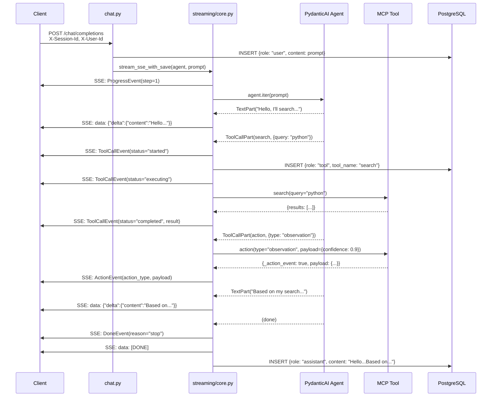
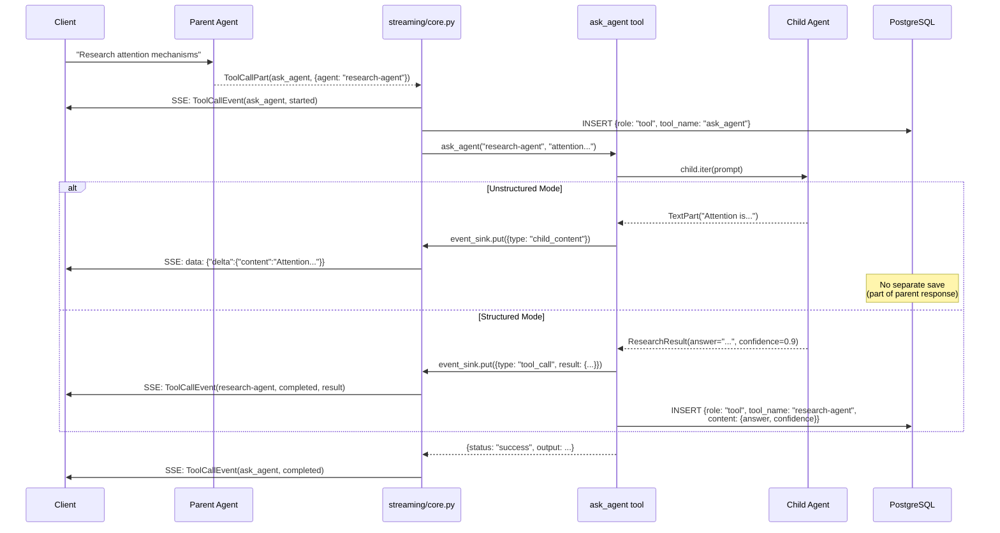

# Code Walkthrough 1: Agent Construction

**PydanticAI Docs:** <https://ai.pydantic.dev/>

---

## The Big Picture

```python
# tests/unit/test_agent_construction.py::TestAgentCreationIntegration
agent = Agent(
    model="openai:gpt-4",
    tools=tools,           # ← Where do these come from?
    system_prompt=prompt,  # ← How is this built?
    output_type=str,       # ← Structured or unstructured?
)
```

---

## 1. Tools

```python
# tests/unit/test_tool_signature.py::test_tool_json_schema_generation
# tests/integration/test_remote_mcp_tools.py::test_pydanticai_extracts_correct_schema_from_wrapper

agent_tools = []  # This list gets passed to Agent(tools=agent_tools)

# LOCAL: Get tools from FastMCP server
# remlight/api/mcp_main.py:142-147
mcp_tools = await mcp.get_tools()  # Returns dict[str, FunctionTool]

# Extract callable (PydanticAI needs raw function, not FunctionTool)
# remlight/agentic/provider.py:882-886
for tool in mcp_tools.values():
    agent_tools.append(tool.fn)  # tool.fn IS the original Python function

# REMOTE: Fetch schema from MCP server, build annotated wrapper
# remlight/agentic/tool_resolver.py:92-130
schemas = await fetch_mcp_tool_schemas(endpoint)  # Connect via FastMCP Client

# remlight/agentic/tool_resolver.py:138-252
for name, schema in schemas.items():
    wrapper = create_annotated_mcp_wrapper(name, schema["description"], schema["inputSchema"], endpoint)
    # Creates: async def search(query: str, limit: int = 20) -> dict
    agent_tools.append(wrapper)  # Same list - wrapper is just a callable

# Both local and remote end up as callables in agent_tools
agent = Agent(model="openai:gpt-4", tools=agent_tools)
```

---

## 2. System Prompt (Unstructured Mode)

**Input: schemas/research-agent.yaml**
```yaml
type: object
description: |
  You are a research assistant with access to a knowledge base.
  Use the search tool to find information before answering.

properties:
  answer:
    type: string
    description: Your response to the user
  confidence:
    type: number
    description: How confident you are (0.0 to 1.0)
  sources:
    type: array
    items: { type: string }
    description: Entity keys you referenced

json_schema_extra:
  kind: agent
  name: research-agent
  tools:
    - name: search
    - name: action
  extension: |
    Always use the action tool to emit observations with confidence scores.
```

**Code that builds the final prompt:**
```python
# tests/unit/test_agent_construction.py::TestSystemPromptConstruction
# tests/unit/test_provider.py::TestConvertPropertiesToPrompt

# remlight/agentic/provider.py:740-780
parts = []
if context.user_context:
    parts.append(f"## User Context\n{context.user_context}")
parts.append(schema.description)                    # Main system prompt
parts.append(schema.json_schema_extra.extension)    # Additional instructions
base_prompt = "\n\n".join(parts)

# remlight/agentic/provider.py:821-827 (unstructured mode)
# remlight/agentic/provider.py:476-593
properties_guidance = _convert_properties_to_prompt(schema.properties)
final_prompt = base_prompt + "\n\n" + properties_guidance
```

**Final system_prompt sent to LLM:**
```text
## User Context
Date: 2024-01-15
User: John Doe

You are a research assistant with access to a knowledge base.
Use the search tool to find information before answering.

Always use the action tool to emit observations with confidence scores.

## Internal Thinking Structure (DO NOT output these labels)

Use this structure to organize your thinking, but ONLY output the answer content:

**OUTPUT (what the user sees):** Your response to the user

**INTERNAL (for your tracking only - do NOT include in output):**

Schema (use these EXACT field names):
    confidence: number
      # How confident you are (0.0 to 1.0)
    sources: [string]
      # Entity keys you referenced

CRITICAL: Your response must be ONLY the conversational answer text.
Do NOT output field names like 'answer:' or JSON - just the response itself.
```

### Structured Mode

```python
# tests/unit/test_agent_construction.py::test_schema_wrapper_strips_description
# remlight/agentic/provider.py:812-818, 320-382

# Properties become Pydantic model, NO inline guidance added
output_type = _create_schema_wrapper(model, strip_description=True)
# LLM outputs JSON: {"answer": "...", "confidence": 0.9, "sources": ["key1"]}
```

---

## 3. Schema Loading

```python
# tests/unit/test_agent_construction.py::TestSchemaLoading

# Priority: cache → database → file
# remlight/agentic/schema.py:220-280
schema = await load_agent_schema("my-agent", cache=cache)

# Parse YAML to AgentSchema
# remlight/agentic/schema.py:180-210
schema = schema_from_yaml(yaml_content)
```

---

## 4. Agent Cache

```python
# High-level: create_agent checks cache, resolves model from settings/schema
# remlight/agentic/provider.py:680-720
agent = await create_agent(schema="research-agent")  # model comes from settings or schema
```

**Model resolution priority:**
```python
# remlight/agentic/provider.py:757-766
# 1. schema.override_model  ← Agent REQUIRES specific model (highest)
# 2. model_name parameter   ← Request/CLI override
# 3. settings.llm.default_model  ← Environment default (lowest)

if meta.override_model:
    resolved_model = meta.override_model
elif model_name:
    resolved_model = model_name
else:
    resolved_model = settings.llm.default_model
```

Agents are expensive to construct (parse schema, build tools, compile prompt). Cache them.

```python
# tests/unit/test_agent_construction.py::TestAgentCache

# remlight/agentic/provider.py:130-180
class AgentCache:
    def __init__(self, max_size=100, ttl_seconds=300):
        self._cache: dict[str, tuple[Agent, float]] = {}  # key → (agent, timestamp)

    # remlight/agentic/provider.py:135-151
    def _compute_key(self, schema, resolved_model, user_id) -> str:
        schema_hash = hashlib.md5(json.dumps(schema).encode()).hexdigest()[:12]
        return f"{schema_hash}:{resolved_model}:{user_id[:8]}"
```

**Cache lookup flow:**
```python
# remlight/agentic/provider.py:774-779
cache_key = _compute_cache_key(schema, resolved_model, user_id)
cached_agent = await _get_cached_agent(cache_key)
if cached_agent is not None:
    return cached_agent  # Cache hit - skip construction

# Cache miss - build the agent (expensive)
agent = Agent(model=resolved_model, tools=agent_tools, system_prompt=prompt)
```

**Cache key includes:**
| Field | Why |
|-------|-----|
| `schema_hash` | Different schemas = different agents |
| `resolved_model` | gpt-4 vs gpt-3.5 = different behavior |
| `user_id` | Per-user agent instances |

---

## 5. Verify It Works

```python
# Inspect what PydanticAI sees
agent = Agent(model="test", tools=[search])

# Tool schema sent to LLM
schema = agent._function_toolset.tools["search"].function_schema.json_schema
# {"properties": {"query": {"type": "string"}, "limit": {"default": 20}}, "required": ["query"]}

# Run: pytest tests/unit/test_tool_signature.py -v -s
```

---

## Test Coverage

| What | Test |
|------|------|
| Tool signatures | `test_tool_signature.py::test_tool_json_schema_generation` |
| Remote MCP | `test_remote_mcp_tools.py::test_pydanticai_extracts_correct_schema_from_wrapper` |
| System prompt | `test_agent_construction.py::TestSystemPromptConstruction` |
| Unstructured mode | `test_provider.py::TestConvertPropertiesToPrompt` |
| Description cleaning | `test_agent_construction.py::test_schema_wrapper_strips_description` |
| Schema loading | `test_agent_construction.py::TestSchemaLoading` |
| Agent cache | `test_agent_construction.py::TestAgentCache` |

```bash
pytest tests/unit/test_tool_signature.py tests/unit/test_agent_construction.py tests/integration/test_remote_mcp_tools.py -v
```

---

# Code Walkthrough 2: API Request Flow

**How a request flows from HTTP headers to streaming agent response.**

---

## The Big Picture

```
HTTP Request → Headers → Context → Session Load → Agent.iter() → SSE Stream
```

```python
# remlight/api/routers/chat.py:60-179

POST /chat/completions
Headers: X-User-Id, X-Session-Id, X-Agent-Schema
Body: {"messages": [...], "stream": true}

         ↓

context = await AgentContext.from_headers_with_profile(dict(req.headers))
         ↓
raw_history = await store.load_session_messages(session_id)
message_history = session_to_pydantic_messages(raw_history, system_prompt)
         ↓
agent_runtime = await create_agent(schema, tools, context)
         ↓
return StreamingResponse(
    stream_sse_with_save(agent, prompt, message_history=message_history)
)
```

---

## 1. Headers to Context

```python
# tests/unit/test_agentic.py::TestAgentContext::test_from_headers

# remlight/api/routers/chat.py:84
context = await AgentContext.from_headers_with_profile(dict(req.headers))

# remlight/agentic/context.py:776-800
# Header mappings:
#   X-User-Id        → user_id
#   X-Session-Id     → session_id
#   X-Tenant-Id      → tenant_id (default: "default")
#   X-Agent-Schema   → agent_schema_uri
#   X-Model-Name     → default_model
#   X-Is-Eval        → is_eval

# remlight/agentic/context.py:758-772
def from_headers(cls, headers: dict[str, str]) -> "AgentContext":
    normalized = {k.lower(): v for k, v in headers.items()}
    return cls(
        user_id=normalized.get("x-user-id"),
        tenant_id=normalized.get("x-tenant-id", "default"),
        session_id=normalized.get("x-session-id"),
        default_model=normalized.get("x-model-name") or settings.llm.default_model,
        agent_schema_uri=normalized.get("x-agent-schema"),
    )
```

---

## 2. Session Message Loading

```python
# remlight/api/routers/chat.py:125-151

if session_id:
    # remlight/services/session/store.py:600-680
    store = SessionMessageStore(user_id=user_id or "anonymous")
    raw_history = await store.load_session_messages(
        session_id=session_id,
        compress_on_load=True,  # Truncate long assistant messages
    )

    # remlight/services/session/pydantic_messages.py:132-200
    # Converts [{role, content}] → [ModelRequest, ModelResponse]
    message_history = session_to_pydantic_messages(
        raw_history,
        system_prompt=schema.description,  # REQUIRED for multi-turn
    )
```

**Storage format → PydanticAI format:**
```
[{"role": "user", "content": "..."},       →  [ModelRequest(UserPromptPart),
 {"role": "assistant", "content": "..."}]      ModelResponse(TextPart)]
```

---

## 3. Agent Iteration (Streaming)

```python
# remlight/api/routers/chat.py:166-179
return StreamingResponse(
    stream_sse_with_save(agent, prompt, message_history=message_history),
    media_type="text/event-stream",
)

# remlight/agentic/streaming/core.py:161-310
async def stream_sse(agent, prompt, *, message_history=None, context=None):
    # Set context for multi-agent propagation
    set_current_context(context)
    set_event_sink(asyncio.Queue())  # For child agent events

    iter_kwargs = {"message_history": message_history} if message_history else {}

    # PydanticAI iteration pattern
    async with agent.iter(prompt, **iter_kwargs) as agent_run:
        async for node in agent_run:
            if Agent.is_model_request_node(node):
                # LLM generating → yield content chunks
                async for chunk in handle_model_request(node):
                    yield format_sse(chunk)

            elif Agent.is_call_tools_node(node):
                # Tools executing → yield tool events
                async for chunk in handle_tool_calls(node):
                    yield format_sse(chunk)

    yield "data: [DONE]\n\n"
```

---

## 4. ContextVar for Multi-Agent

```python
# remlight/agentic/context.py:145-167

# ContextVars enable tools to access parent context without threading params
_current_agent_context: ContextVar["AgentContext | None"]
_parent_event_sink: ContextVar["asyncio.Queue | None"]

# In streaming layer (before agent.run):
set_current_context(context)
set_event_sink(child_event_queue)

# In MCP tool (e.g., ask_agent):
parent_ctx = get_current_context()
child_ctx = parent_ctx.child_context(agent_schema_uri="child-agent")
# child inherits: user_id, session_id, tenant_id
```

---

## 5. Message Persistence

```python
# remlight/api/routers/chat.py:153-158
# BEFORE streaming - ensure user message is saved even if agent fails
await save_user_message(session_id, user_id, prompt)

# remlight/agentic/streaming/core.py:777-940
# AFTER streaming completes - save assistant response + tool calls
async def stream_sse_with_save(...):
    messages_to_save = []
    async for chunk in stream_sse(...):
        yield chunk
        # Accumulate content...

    # Save accumulated response
    await store.store_session_messages(session_id, messages_to_save)
```

**Order matters:**
1. `save_user_message()` - Before agent (user input preserved on crash)
2. `stream_sse_with_save()` - After streaming (assistant + tools)

---

## Complete Flow Summary

```
┌─────────────────────────────────────────────────────────────────┐
│  HTTP POST /chat/completions                                    │
│  Headers: X-User-Id, X-Session-Id, X-Agent-Schema               │
└────────────────────────────┬────────────────────────────────────┘
                             │
                             ▼
┌─────────────────────────────────────────────────────────────────┐
│  AgentContext.from_headers_with_profile(headers)                │
│  remlight/agentic/context.py:776-800                            │
│                                                                 │
│  Returns: AgentContext(user_id, session_id, tenant_id, ...)     │
└────────────────────────────┬────────────────────────────────────┘
                             │
                             ▼
┌─────────────────────────────────────────────────────────────────┐
│  SessionMessageStore.load_session_messages(session_id)          │
│  remlight/services/session/store.py:600-680                     │
│                                                                 │
│  Returns: [{"role": "user", ...}, {"role": "assistant", ...}]   │
└────────────────────────────┬────────────────────────────────────┘
                             │
                             ▼
┌─────────────────────────────────────────────────────────────────┐
│  session_to_pydantic_messages(raw_history, system_prompt)       │
│  remlight/services/session/pydantic_messages.py:132-200         │
│                                                                 │
│  Returns: [ModelRequest, ModelResponse, ...]                    │
└────────────────────────────┬────────────────────────────────────┘
                             │
                             ▼
┌─────────────────────────────────────────────────────────────────┐
│  create_agent(schema, tools, context)                           │
│  remlight/agentic/provider.py:680-850                           │
│                                                                 │
│  Returns: AgentRuntime(agent=Agent(...))                        │
└────────────────────────────┬────────────────────────────────────┘
                             │
                             ▼
┌─────────────────────────────────────────────────────────────────┐
│  stream_sse_with_save(agent, prompt, message_history=...)       │
│  remlight/agentic/streaming/core.py:777-940                     │
│                                                                 │
│  async with agent.iter(prompt, message_history=...) as run:     │
│      async for node in run:                                     │
│          yield SSE events                                       │
└─────────────────────────────────────────────────────────────────┘
```

---

## Test Coverage

| What | Test |
|------|------|
| Headers to context | `test_agentic.py::TestAgentContext::test_from_headers` |
| Session loading | `test_session_store.py::TestSessionMessageStore` |
| Pydantic conversion | `test_session_pydantic.py::test_session_to_pydantic_messages` |
| Streaming | `test_streaming.py::TestStreamSSE` |

```bash
pytest tests/unit/test_agentic.py tests/unit/test_session_store.py -v
```

---

# Code Walkthrough 3: Structured Output & Tool Persistence

**How structured metadata flows from tools to SSE stream to database.**

---

## Two Patterns for Structured Output

### Pattern 1: PydanticAI Structured Mode

When `structured_output=True`, PydanticAI enforces JSON output:

```python
# remlight/agentic/provider.py:812-818
if structured_output:
    output_type = _create_schema_wrapper(model, strip_description=True)
    agent = Agent(model=model, output_type=output_type, ...)
    # LLM outputs: {"answer": "...", "confidence": 0.9, "sources": [...]}
```

### Pattern 2: Action Tool (Unstructured Mode)

For streaming structured metadata alongside free-form text:

```python
# remlight/api/routers/tools.py:402-456
async def action(type: str, payload: dict | None = None) -> dict:
    """Agent calls: action(type='observation', payload={confidence, sources})"""
    return {
        "_action_event": True,      # ← Marker for streaming layer
        "action_type": type,
        "payload": payload,
    }
```

---

## MCP Tool Signatures

### search

```python
# remlight/api/routers/tools.py:280-400
async def search(
    query: str,                    # REM query: "LOOKUP key", "SEARCH text IN table", "FUZZY text"
    limit: int = 20,               # Max results
    user_id: str | None = None,    # For user-scoped data
) -> dict:
    """Execute REM queries against the knowledge base."""
```

### action

```python
# remlight/api/routers/tools.py:402-456
async def action(
    type: str,                     # "observation", "elicit", "delegate"
    payload: dict | None = None,   # {confidence, sources, session_name, ...}
) -> dict:
    """
    Emit typed action events for SSE streaming.

    Action Types:
        observation: Record metadata (confidence, sources, etc.)
        elicit: Request user input (question, options)
        delegate: Signal delegation (internal)
    """
```

### ask_agent

```python
# remlight/api/routers/tools.py:459-650
async def ask_agent(
    agent_name: str,                          # Agent schema name (e.g., "research-agent")
    input_text: str,                          # Query to send to child agent
    input_data: dict | None = None,           # Optional structured input
    user_id: str | None = None,               # Override parent's user_id
    timeout_seconds: int = 300,               # Max execution time
    structured_output_override: bool | None = None,  # Override schema's structured_output
) -> dict:
    """
    Invoke another agent by name for multi-agent orchestration.

    Child agents inherit from parent context:
        - user_id, session_id, tenant_id
        - Session history (for conversation continuity)

    Returns:
        {status, output, text_response, agent_schema, is_structured_output}
    """
```

**Context inheritance flow:**
```python
# remlight/api/routers/tools.py:494-517
parent_context = get_current_context()           # From ContextVar
child_context = parent_context.child_context(    # Inherits identity
    agent_schema_uri=agent_name
)
# child has same: user_id, session_id, tenant_id
# child has different: agent_schema_uri
```

---

## Tool Call Streaming Flow

```
LLM generates ToolCallPart
        │
        ▼ (PartStartEvent)
emit ToolCallEvent(status="started", tool_name, arguments)
        │
        ▼ (PartEndEvent - args complete)
Save to DB: {role: "tool", tool_call_id, tool_name, content: args_json}
emit ToolCallEvent(status="executing")
        │
        ▼ (Tool executes, returns result)
        │
        ├── if result._action_event == True:
        │       emit ActionEvent(action_type, payload)  ← Structured metadata
        │
        └── else:
                emit ToolCallEvent(status="completed", result)
```

---

## ask_agent: Structured vs Unstructured

```python
# remlight/api/routers/tools.py:459-750

# Both modes: child agent runs and returns result
result = await agent_runtime.agent.run(prompt)
raw_output = result.output
is_structured_output = is_pydantic_model(raw_output)

# ┌─────────────────────────────────────────────────────────────────┐
# │ UNSTRUCTURED MODE (is_structured_output = False)                │
# │ Child returns: "Here's what I found about Python..."            │
# └─────────────────────────────────────────────────────────────────┘

# SSE: Stream text chunks as they arrive (:600-604)
await event_sink.put({
    "type": "child_content",
    "agent_name": agent_name,
    "content": "Here's what I found...",  # Streamed incrementally
})
# → Parent yields: data: {"choices":[{"delta":{"content":"Here's..."}}]}

# DB: Nothing extra saved (text is part of parent's assistant response)


# ┌─────────────────────────────────────────────────────────────────┐
# │ STRUCTURED MODE (is_structured_output = True)                   │
# │ Child returns: ResearchResult(answer="...", confidence=0.9)     │
# └─────────────────────────────────────────────────────────────────┘

# SSE: Emit as tool_call event with structured result (:699-707)
await event_sink.put({
    "type": "tool_call",
    "tool_name": agent_name,
    "tool_id": f"{agent_name}_structured_output",
    "status": "completed",
    "result": {"answer": "...", "confidence": 0.9},  # Full Pydantic model
})
# → Parent yields: event: tool_call\ndata: {"tool_name":"research-agent","result":{...}}

# DB: Save as tool message (:711-733)
await store.store_session_messages(session_id, [{
    "role": "tool",
    "tool_call_id": f"{agent_name}_structured_output",
    "tool_name": agent_name,
    "content": json.dumps({"answer": "...", "confidence": 0.9}),
}])
```

---

## Summary Table

| | Unstructured | Structured |
|---|---|---|
| **Output** | `str` | Pydantic model |
| **SSE event** | `child_content` (streamed) | `tool_call` (complete) |
| **DB save** | Part of assistant message | Separate tool message |
| **Frontend** | Render as text | Render as card/form |

---

## Sequence Diagram: Agent Execution Flow



---

## Sequence Diagram: ask_agent (Multi-Agent)



---

## Database Persistence

### Tool Messages (saved during streaming at PartEndEvent)

```python
# remlight/agentic/streaming/core.py:559-582
tool_msg = {
    "role": "tool",
    "content": json.dumps(args_dict),  # Tool arguments as JSON
    "tool_call_id": tool_id,
    "tool_name": tool_name,
    "agent_schema": agent_schema,
    "model": model,
    "timestamp": "...",
}
await store.store_session_messages(session_id, [tool_msg])
```

### Assistant Message (saved after streaming completes)

```python
# remlight/agentic/streaming/core.py:902-927
assistant_message = {
    "id": message_id,
    "role": "assistant",
    "content": "".join(accumulated_content),  # Full response text
    "timestamp": "...",
}
await store.store_session_messages(session_id, [assistant_message])
```

---

## SSE Event Types

| Event | Purpose | Source |
|-------|---------|--------|
| `ToolCallEvent` | Tool invocation lifecycle (started/executing/completed) | Any tool call |
| `ActionEvent` | Structured metadata stream | `action()` tool with `_action_event` marker |
| `MetadataEvent` | Observation data (confidence, sources) | `action(type="observation")` |
| Content chunks | Agent text output | LLM TextPart |

---

## Example: Research Agent Flow

**Agent schema:**
```yaml
tools:
  - name: search
  - name: action  # For structured metadata
```

**Agent execution:**
1. `search("LOOKUP python-tutorial")` → ToolCallEvent
2. LLM generates response text → Content chunks
3. `action(type="observation", payload={confidence: 0.9, sources: ["python-tutorial"]})` → ActionEvent

**SSE stream:**
```
data: {"event":"tool_call","data":{"tool_name":"search","status":"started"}}
data: {"event":"tool_call","data":{"tool_name":"search","status":"completed"}}
data: {"choices":[{"delta":{"content":"Python tutorials are..."}}]}
data: {"event":"action","data":{"action_type":"observation","payload":{"confidence":0.9}}}
data: [DONE]
```

**Database (messages table):**
```
| role      | content                             | tool_name | tool_call_id |
|-----------|-------------------------------------|-----------|--------------|
| user      | "Tell me about Python"              |           |              |
| tool      | {"query":"LOOKUP python-tutorial"}  | search    | call_abc123  |
| assistant | "Python tutorials are..."           |           |              |
```

---

## Persistence Order

```
1. save_user_message()           ← BEFORE streaming (crash-safe)
2. Tool calls saved at PartEndEvent  ← DURING streaming (chronological order)
3. Assistant message saved       ← AFTER streaming completes
```

This ensures:
- User message preserved even if agent crashes
- Parent tool calls appear before child tool calls
- Complete assistant response (not partial)
