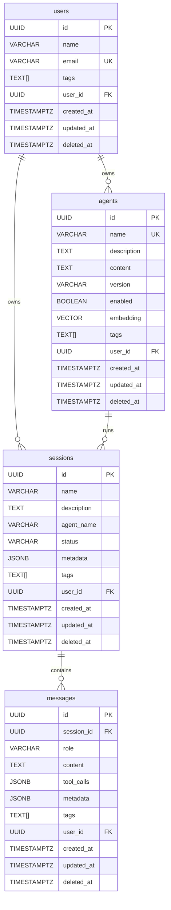
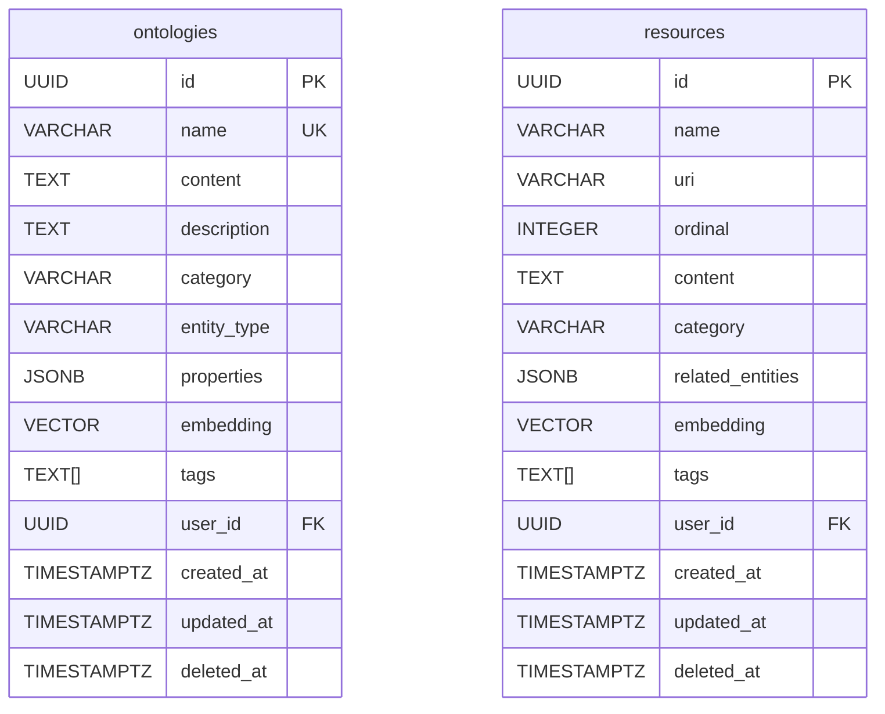

# REMLight Core Schema (Slim)

Minimal ERD for the core REMLight system tables.

## System Fields

All tables include these system fields:

| Field      | Type        | Description                            |
| ---------- | ----------- | -------------------------------------- |
| id         | UUID        | Primary key                            |
| tags       | TEXT[]      | Array of tags for categorization       |
| user_id    | UUID        | Owner/creator reference                |
| created_at | TIMESTAMPTZ | Record creation timestamp              |
| updated_at | TIMESTAMPTZ | Last modification timestamp            |
| deleted_at | TIMESTAMPTZ | Soft delete timestamp (NULL if active) |

## Core Models

Core tables for the agentic system: users, agents, sessions, and messages.



### users

User accounts and profiles for the system.
Tracks identity, preferences, and ownership of other entities.

| Column     | Type        | Description                     |
| ---------- | ----------- | ------------------------------- |
| id         | UUID        | Primary key                     |
| name       | VARCHAR     | Display name                    |
| email      | VARCHAR     | Unique email address            |
| tags       | TEXT[]      | User tags/labels                |
| user_id    | UUID        | Self-reference or admin creator |
| created_at | TIMESTAMPTZ | Account creation time           |
| updated_at | TIMESTAMPTZ | Last profile update             |
| deleted_at | TIMESTAMPTZ | Soft delete timestamp           |

### agents

Stored agent definitions for the agentic runtime.
Agents are defined declaratively in YAML and stored in the database for runtime loading.
The `content` field holds the full YAML spec; `description` is an optional summary for search.

| Column      | Type        | Description                       |
| ----------- | ----------- | --------------------------------- |
| id          | UUID        | Primary key                       |
| name        | VARCHAR     | Unique agent identifier           |
| description | TEXT        | Optional short description        |
| content     | TEXT        | Full YAML agent spec              |
| version     | VARCHAR     | Schema version (default 1.0.0)    |
| enabled     | BOOLEAN     | Whether agent is active           |
| embedding   | VECTOR      | Semantic search vector            |
| tags        | TEXT[]      | Agent categorization tags         |
| user_id     | UUID        | Owner who created the agent       |
| created_at  | TIMESTAMPTZ | Agent creation time               |
| updated_at  | TIMESTAMPTZ | Last configuration update         |
| deleted_at  | TIMESTAMPTZ | Soft delete timestamp             |

### sessions

Conversation sessions between users and agents.
Each session tracks a single conversation thread with metadata and state.

| Column      | Type        | Description                               |
| ----------- | ----------- | ----------------------------------------- |
| id          | UUID        | Primary key                               |
| name        | VARCHAR     | Session title/name                        |
| description | TEXT        | Session purpose or summary                |
| agent_name  | VARCHAR     | Agent running this session                |
| status      | VARCHAR     | Session state (active, paused, completed) |
| metadata    | JSONB       | Additional session data                   |
| tags        | TEXT[]      | Session categorization tags               |
| user_id     | UUID        | User who owns the session                 |
| created_at  | TIMESTAMPTZ | Session start time                        |
| updated_at  | TIMESTAMPTZ | Last activity time                        |
| deleted_at  | TIMESTAMPTZ | Soft delete timestamp                     |

### messages

Individual messages within a session.
Stores the full conversation history including user inputs, agent responses, and tool calls.

| Column     | Type        | Description                                 |
| ---------- | ----------- | ------------------------------------------- |
| id         | UUID        | Primary key                                 |
| session_id | UUID        | Parent session reference                    |
| role       | VARCHAR     | Message role (user, assistant, system, tool)|
| content    | TEXT        | Message text content                        |
| tool_calls | JSONB       | Tool invocations (for assistant messages)   |
| metadata   | JSONB       | Additional message data (tokens, timing)    |
| tags       | TEXT[]      | Message tags                                |
| user_id    | UUID        | User who sent (for user messages)           |
| created_at | TIMESTAMPTZ | Message timestamp                           |
| updated_at | TIMESTAMPTZ | Edit timestamp                              |
| deleted_at | TIMESTAMPTZ | Soft delete timestamp                       |

## Knowledge Base Models

Tables for storing and searching domain knowledge. These support vector embeddings
for semantic search via the REM query language.



### ontologies

Domain entities using a wiki-style knowledge structure.
Ideal for interconnected concepts like people, projects, topics, and their relationships.
Content is typically ingested from markdown files with YAML frontmatter defining properties
and graph edges to other entities.

| Column      | Type        | Description                          |
| ----------- | ----------- | ------------------------------------ |
| id          | UUID        | Primary key                          |
| name        | VARCHAR     | Unique entity key (from frontmatter) |
| content     | TEXT        | Full markdown content                |
| description | TEXT        | Short description for search         |
| category    | VARCHAR     | Entity category                      |
| entity_type | VARCHAR     | Type classification                  |
| properties  | JSONB       | Frontmatter metadata                 |
| embedding   | VECTOR      | Semantic search vector               |
| tags        | TEXT[]      | Entity tags                          |
| user_id     | UUID        | Owner                                |
| created_at  | TIMESTAMPTZ | Creation time                        |
| updated_at  | TIMESTAMPTZ | Last update                          |
| deleted_at  | TIMESTAMPTZ | Soft delete timestamp                |

### resources

Document chunks and ingested knowledge fragments.
Used for RAG (Retrieval-Augmented Generation) with content from PDFs, web pages,
or other documents split into searchable chunks. The `ordinal` field preserves
chunk ordering within a source document.

| Column           | Type        | Description                        |
| ---------------- | ----------- | ---------------------------------- |
| id               | UUID        | Primary key                        |
| name             | VARCHAR     | Resource name                      |
| uri              | VARCHAR     | Source document URI                |
| ordinal          | INTEGER     | Chunk order within source          |
| content          | TEXT        | Chunk text content                 |
| category         | VARCHAR     | Resource category                  |
| related_entities | JSONB       | Links to ontology entities         |
| embedding        | VECTOR      | Semantic search vector             |
| tags             | TEXT[]      | Resource tags                      |
| user_id          | UUID        | Owner                              |
| created_at       | TIMESTAMPTZ | Creation time                      |
| updated_at       | TIMESTAMPTZ | Last update                        |
| deleted_at       | TIMESTAMPTZ | Soft delete timestamp              |

## Relationships

| Relationship        | Type | Description                      |
| ------------------- | ---- | -------------------------------- |
| users → sessions    | 1:N  | A user owns many sessions        |
| users → agents      | 1:N  | A user owns many agents          |
| agents → sessions   | 1:N  | An agent runs many sessions      |
| sessions → messages | 1:N  | A session contains many messages |

## Embeddings

Embeddings are generated when the model has `embedding_field` in `model_config`.

| Table      | Config                       | Source      | Fallback |
| ---------- | ---------------------------- | ----------- | -------- |
| ontologies | `embedding_field: True`      | description | content  |
| resources  | `embedding_field: "content"` | content     | -        |
| agents     | `embedding_field: True`      | description | content  |

Tables without `embedding_field` config (users, sessions, messages) do not generate embeddings.

## Notes: Session Associations

Sessions can be associated with external entities for organization, retrieval, and analysis.

### Scenarios

The `scenarios` table tags sessions that have interesting characteristics for:
- **Integration testing**: Mark sessions that exercise specific code paths
- **Evals**: Label sessions for evaluation datasets and benchmarks
- **Demos**: Tag exemplary conversations for showcasing agent capabilities

Scenarios have their own embeddings on the description field, enabling semantic search
across labeled sessions (e.g., "find sessions about authentication issues").

### Cases (Future)

Cases represent external project identifiers that sessions can be linked to:

- **Support tickets**: Zendesk, Freshdesk, or Intercom tickets
- **Issue tracking**: Jira, Linear, or GitHub issues
- **CRM records**: Salesforce opportunities or HubSpot deals
- **Custom identifiers**: Any external system's unique IDs

A many-to-many relationship via `case_sessions` allows multiple sessions to be
grouped under one case, and a single session to relate to multiple cases.

Example schema:

```sql
CREATE TABLE cases (
    id UUID PRIMARY KEY,
    external_system VARCHAR(64),   -- 'zendesk', 'jira', 'salesforce'
    external_id VARCHAR(256),      -- ticket/issue/record ID
    external_url VARCHAR(1024),    -- deep link to external system
    metadata JSONB,
    -- system fields...
);

CREATE TABLE case_sessions (
    case_id UUID REFERENCES cases(id),
    session_id UUID REFERENCES sessions(id),
    PRIMARY KEY (case_id, session_id)
);
```

This pattern enables:

- Retrieving all sessions related to a support ticket
- Grouping conversations by project or customer
- Building audit trails linking agent interactions to business outcomes
