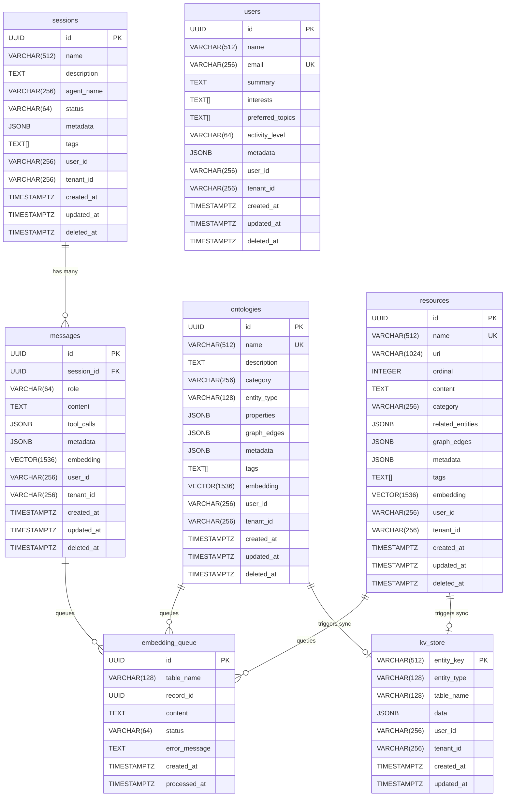

# REMLight Database Schema

Entity Relationship Diagram for the REMLight database (`sql/install.sql`).

## Tables

| Table | Purpose |
|-------|---------|
| `kv_store` | O(1) lookup cache, auto-synced via triggers |
| `ontologies` | Domain entities (people, projects, concepts) with embeddings |
| `resources` | Documents/content chunks with embeddings |
| `users` | User profiles with AI-generated summaries |
| `sessions` | Conversation sessions |
| `messages` | Chat messages linked to sessions |
| `embedding_queue` | Async queue for embedding generation |

## Relationships

- **messages → sessions**: Foreign key with `ON DELETE CASCADE`
- **ontologies/resources → kv_store**: Trigger-based sync for fast lookups
- **ontologies/resources/messages → embedding_queue**: Trigger-based queue for async embedding generation

## REM Functions

The schema includes PostgreSQL functions for the REM query language:

| Function | Purpose |
|----------|---------|
| `rem_lookup(key)` | O(1) KV store lookup |
| `rem_search(embedding, table, limit)` | Semantic vector search |
| `rem_fuzzy(text)` | Fuzzy text search using trigrams |
| `rem_traverse(key, depth)` | Graph traversal following edges |
